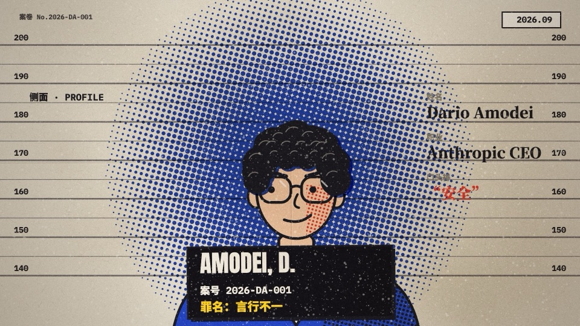
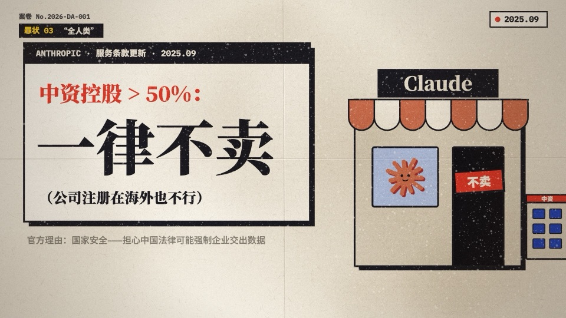

# dario-shabi · 为什么 Dario 是个大傻逼

A 51-second satirical short film in Chinese, styled as a riso-printed case file against Anthropic's CEO. Every frame and every note of the score is generated in code. There is no footage, no image assets and no audio samples: the film is one HTML file that draws on a `<canvas>` and synthesizes its 128 BPM soundtrack sample by sample.

一部 51 秒的中文讽刺短片，以孔版印刷（riso）风格的「案卷」形式呈现。画面与音乐全部由代码实时生成：一个 HTML 文件，用 Canvas 绘制每一帧，用代码逐采样合成 128 BPM 的配乐。

[](https://video.aigenius.media/film.mp4)

| | |
|---|---|
|  |  |

**▶ Watch:** [film.mp4 (1080p, sound on)](https://video.aigenius.media/film.mp4)

## Run it

Open `film.html` in a desktop browser and press play (with sound). It needs an internet connection for Google Fonts.

## Render to MP4

Requires Node 18+ and a local Chrome or Chromium. ffmpeg is bundled through `ffmpeg-static`.

```sh
npm install
npm run render     # -> film.mp4 + audio.wav (1920×1080, 30 fps)
npm run stills     # -> stills/*.jpg at two points in each scene
```

If Chrome isn't found automatically, set `CHROME_PATH=/path/to/chrome`. For stills at specific times, pass `STILLS_T=3.38,5.44`.

## How it works

- **`film.html`**: the whole film. Scenes are plain functions `(ctx, u, d, t)` placed on a bar grid (`SC` table). Every cut lands on the beat. `renderAt(t)` draws any moment deterministically, so scrubbing and exporting give the same frames.
- **Look**: four riso inks on paper, with halftone dot gradients, misregistered shadows, rubber stamps and grain, all done with Canvas 2D.
- **Sound**: `synth()` builds a stereo PCM buffer in JS (kick, snare, bass, stabs and hits timed to scene cuts). The browser plays it through WebAudio, and the renderer exports it as WAV.
- **`render.js`**: loads `film.html?export=1` in headless Chrome through Puppeteer, steps through the film frame by frame, and pipes JPEG frames plus the synthesized WAV into ffmpeg (H.264 + AAC).

## Disclaimer

This is satire and commentary on a public figure. It is not affiliated with or endorsed by Anthropic. The jokes, framing and conclusions are opinion. The quotes and figures come from the public sources below, which are also summarized on the end card and in the note under the player in `film.html`.

### Sources

| Scene (timestamp) | Claim in the film | Source |
|---|---|---|
| Count 02 · jobs (~13 s) | "Within 1–5 years, AI could wipe out half of entry-level white-collar jobs." | Axios, [*Behind the Curtain: A white-collar bloodbath*](https://www.axios.com/2025/05/28/ai-jobs-white-collar-unemployment-anthropic), 28 May 2025 (interview with Dario Amodei) |
| Count 02 · valuation (~16 s) | Anthropic valued at $61.5B (2025.03) → $183B (2025.09) → $380B (2026.02) → $965B (2026.05) | Anthropic: [Series E](https://www.anthropic.com/news/anthropic-raises-series-e-at-usd61-5b-post-money-valuation), [Series F](https://www.anthropic.com/news/anthropic-raises-series-f-at-usd183b-post-money-valuation), [Series G](https://www.anthropic.com/news/anthropic-raises-30-billion-series-g-funding-380-billion-post-money-valuation), [Series H](https://www.anthropic.com/news/series-h); TechCrunch on [Series G](https://techcrunch.com/2026/02/12/anthropic-raises-another-30-billion-in-series-g-with-a-new-value-of-380-billion/) and [Series H](https://techcrunch.com/2026/05/28/anthropic-raises-65-billion-nears-1t-valuation-ahead-of-ipo/) |
| Count 02 · pricing (~18 s) | Claude Max costs $200 / month | [claude.com/pricing](https://claude.com/pricing) (top Max tier) |
| Count 03 · DeepSeek (~20 s) | DeepSeek R1 released 20 January 2025 | [DeepSeek release notes](https://api-docs.deepseek.com/news/news250120) |
| Count 03 · essay (~22 s) | Nine days later: "DeepSeek makes export controls even more existentially important." | Dario Amodei, [*On DeepSeek and Export Controls*](https://darioamodei.com/on-deepseek-and-export-controls), 29 January 2025 |
| Count 03 · terms of service (~27 s) | No sales to entities more than 50% Chinese-owned, even if incorporated abroad; national-security rationale; revenue impact in the hundreds of millions of dollars | Anthropic, [*Updating restrictions of sales to unsupported regions*](https://www.anthropic.com/news/updating-restrictions-of-sales-to-unsupported-regions), September 2025 |
| Count 03 · mission (~31 s) | Mission: "ensure that the world safely makes the transition through transformative AI" | [anthropic.com/company](https://www.anthropic.com/company) |
| Count 03 · mission (~33 s) | Mainland China, Hong Kong and Macau are not supported regions | [anthropic.com/supported-countries](https://www.anthropic.com/supported-countries) |

The 2021 departure from OpenAI in Count 01 and the "Responsible Scaling" driving sequence are commentary rather than quotations. Chinese on-screen quotes are the author's translations. Figures are as of the dates shown in the film and may have changed since.

## License

[MIT](LICENSE) © 2026 Darren Ter
